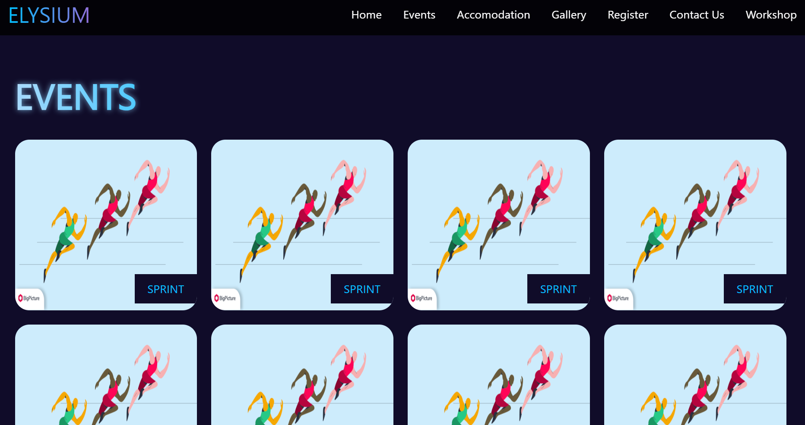
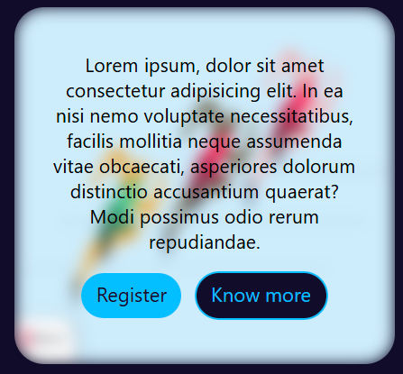
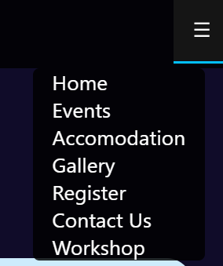

# college-fest-events-page
A responsive college fest website built with HTML, CSS, and JavaScript featuring events showcase, animated UI, and a mobile-friendly navigation menu.

---

## Features  
-  **Animated UI** – Gradient headings, hover effects, and smooth transitions  
-  **Responsive Design** – Works on desktop and mobile screens  
-  **Mobile Navbar** – Hamburger menu with dropdown navigation  
-  **Events Showcase** – Interactive event cards with hover animations and details  
-  **Modern Theme** – Gradient highlights and dark background for a futuristic look  

---

## Tech Stack  
- **HTML5** – Structure  
- **CSS3** – Styling, animations, responsive layout  
- **JavaScript** – Dropdown toggle and interactivity  

---

## Screenshots  

## Live Demo
[(Visit project)](https://arjunvyas2802.github.io/college-fest-events/)

## Learning
This project helped me practice:
  Designing responsive multi-section layouts
  Creating animated cards with hover effects
  Implementing a mobile-friendly navigation bar
  Combining HTML, CSS, and JavaScript for interactive UI
